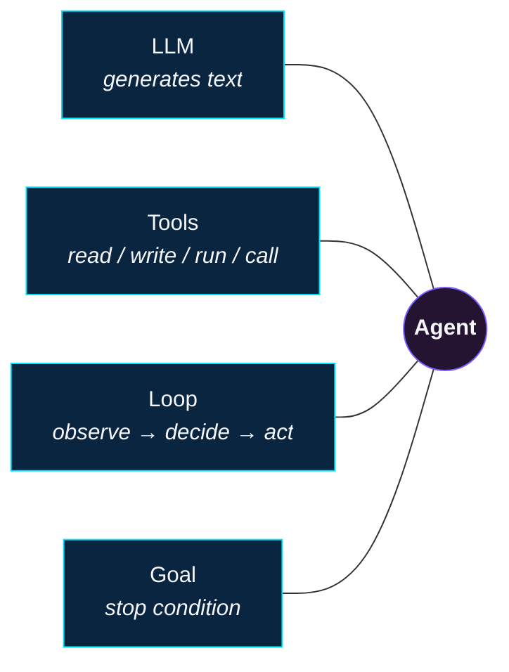
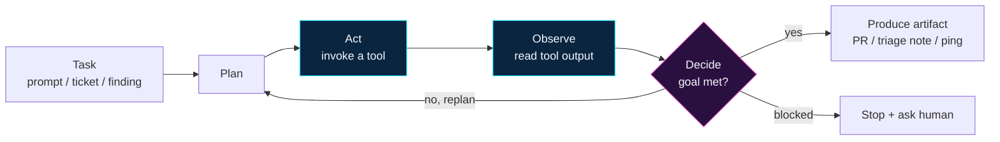
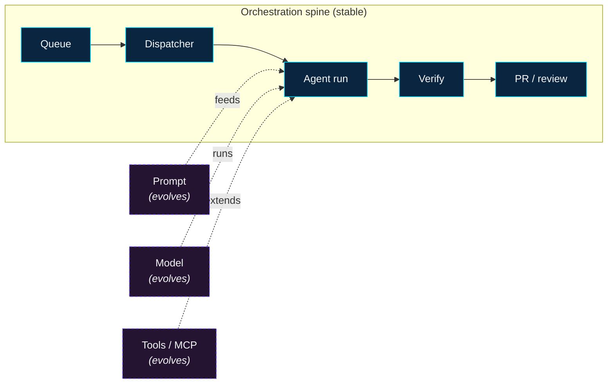
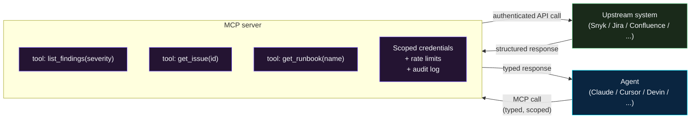
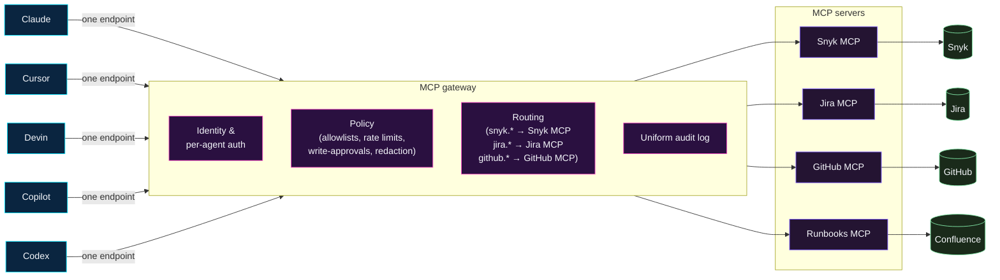


**Who this page is for.** Anyone who's been asked to "stand up an
agent," "write a skill," or "hand this CVE backlog to Claude" and
isn't sure what any of those words mean. No prior ML knowledge
required. By the end of this page you should be able to read every
other page on this site without looking anything up.


The rest of this site is a cookbook: tight, opinionated recipes for
turning specific AI tools into remediation workers. This page is the
**kitchen** — the ideas, vocabulary, and mental models the recipes
assume you already have.

## TL;DR for busy readers

- An **agent** is an LLM running in a loop with access to **tools**
  (file editing, shell, web, APIs) and a goal. It plans, acts,
  observes the result, and keeps going until the goal is met or it
  stops itself.
- **Prompts** are how you steer an agent. They encode your house
  rules, the shape of the task, and the guardrails. The prompt is
  the contract.
- **MCP servers** are the standard way to give an agent direct,
  scoped access to your data (tickets, findings, code, runbooks)
  without handing out broad credentials.
- **Agentic remediation** is using all of the above to close
  security findings — not just log them — at the rate new findings
  arrive.
- Every recipe on this site follows the same three-layer pattern:
  **orchestration stays the same, the prompt / model / tools
  evolve**. Read that line twice; it's the whole point of the site.

## What is an agent?

An **agent** is a large language model (LLM) plugged into three
extra things:

1. **Tools** — concrete actions it can invoke (read a file, run a
   command, call an API, open a PR).
2. **A loop** — after each tool call the agent sees the result and
   decides what to do next, rather than producing one-shot output.
3. **A goal** — a task description that tells it when it's done.

If any of those three is missing, you have something less than an
agent:

- **LLM alone.** Generates text. Cannot do anything on its own.
  Fine for drafting, bad for remediation.
- **LLM + tools, no loop.** A single function call or a one-shot
  completion. Fine for "summarise this alert," bad for "fix this
  CVE."
- **LLM + loop, no tools.** A chatbot. Can talk about fixing the
  problem; cannot actually branch a repo, edit files, and open a
  PR.
- **All three, no goal.** Will thrash. Agents without a crisp stop
  condition burn tokens and produce unhelpful output.

The big shift over the last two years is that (1), (2), and (3) are
now production-grade enough that a well-scoped agent can close a
real security finding end-to-end, reliably, with a human only on
the review step.

### What an agent is **not**

- **Not magic.** Give it a vague goal and it will return a vague
  result — confidently.
- **Not deterministic.** The same prompt can produce different code
  twice in a row. This is why recipes ship with **tests** and
  **guardrails**, not just prompts.
- **Not a replacement for review.** Every recipe on this site ends
  with a human reviewer on the PR. That's the point.
- **Not a new kind of engineer.** It's a fast, tireless,
  medium-skill contributor who needs supervision and a clear
  runbook — the same things a good intern needs.

## The agent loop, concretely

Every agent on this site runs a variant of the same loop:

1. **Read the task.** A prompt, a ticket, a finding ID.
2. **Plan.** "First I'll look at the lockfile. Then I'll check the
   advisory. Then I'll bump the version and run tests."
3. **Act.** Invoke a tool — read a file, run `pnpm install`, call
   an MCP endpoint.
4. **Observe.** Read the tool's output.
5. **Decide.** Goal met? Stop. Not met? Back to step 2 with new
   information.
6. **Produce the artifact.** A PR, a triage note, or a "stopped and
   asked a human" ping.

The failure mode you care about most is step 5 going wrong — the
agent "deciding" to do something the prompt didn't authorise (touch
a migration, skip a test, mass-edit unrelated files). The
guardrails on every recipe exist to catch exactly that failure.

## The five tools this site covers

All five tools are the same idea — LLM + tools + loop + goal — with
different packaging, integration surface, and pricing. Pick the one
your team already has licenses for; don't shop for a new agent just
to follow this site.

| Tool | Surface | Best at | Where the recipe lives |
| ---- | ------- | ------- | ---------------------- |
| **GitHub Copilot** | Inside GitHub / VS Code. Issue-driven via the Coding Agent. | Teams already standardised on GitHub. Short, well-scoped tasks dispatched as issues. | [Agents → Copilot]() |
| **Claude** (Code + Agent SDK) | Terminal-native CLI, Skills, hooks, plus a programmatic SDK. | Deep customisation with Skills and `PreToolUse`/`PostToolUse` hooks; mixed interactive + batch use. | [Agents → Claude]() |
| **Cursor** (Agent + Background Agents) | Inside the Cursor editor. Background Agents run headlessly on Cursor's infra. | Engineer-driven interactive fixes plus overnight batch runs, all from the same editor. | [Agents → Cursor]() |
| **Codex** (CLI + Cloud) | Sandboxed CLI; cloud agent. Driven by a small script that fills prompt templates. | Batch remediation with strong isolation. Good fit when you want to treat remediation like a scheduled job. | [Agents → Codex]() |
| **Devin** (Cognition) | Fully managed, autonomous agent with its own sandbox and integrations. | End-to-end "ticket in, PR out" when you don't want to run your own sandbox. | [Agents → Devin]() |

The recipes are opinionated but the choice of tool is not — every
page on this site has the same guardrails regardless of which
engine it targets.

## Why prompts are important

The prompt is **where your policy lives**. A model is a
general-purpose code generator; your prompt is what turns it into
*your* team's remediation worker.

A good remediation prompt carries four things:

1. **The task.** "Bump the affected dependency to the lowest
   non-vulnerable version."
2. **The house rules.** Branch naming, commit conventions, PR
   template, test runner, what files never to touch.
3. **The stop conditions.** "If the fix requires a major version
   bump, stop and write a triage note. Do not force it through."
4. **The output contract.** "Open a draft PR linked to the finding
   ID. Include blast radius. Never merge."

These four live in different files depending on the tool —
`CLAUDE.md`, `AGENTS.md`, `.github/copilot-instructions.md`,
`.cursor/rules/*.mdc`, a Devin Knowledge entry — but the *shape*
is the same. That's why the [Prompt Library]()
on this site is organised by tool: the content transfers between
tools, the packaging does not.

### Prompt engineering in one paragraph

Be specific. Give examples when you can. Name the files you care
about and the files you don't. State the stop conditions before the
happy path, not after. Assume the model is a new-hire engineer with
no memory — everything you don't write down, the agent will guess
at, and guessing is where silent bugs come from.

### Prompt, model, and tools evolve — orchestration doesn't

Every agent recipe on this site calls this out in its **Orchestration**
section. The pattern worth internalising:

- The **orchestration spine** (queue → dispatcher → agent → PR →
  reviewer) is built once and stays constant.
- The **prompt** is rewritten as you learn what reduces reviewer
  pushback.
- The **model** changes as newer/faster/better models ship — the
  orchestration doesn't care which one it's talking to.
- The **tools** grow as you connect new MCP servers — again, the
  orchestration doesn't care.

That separation is what lets security keep shipping improvements
without rewriting pipelines.

## Why agentic remediation is important

Modern security programs are bottlenecked on the same math:

- **Finding volume is up and to the right.** SCA, SAST, DAST, DLP,
  CSPM, secret scanners — every category has more signal every year.
- **Human remediation capacity is flat.** You can't 10× a security
  team. You can't easily convince product teams to 10× the time
  they spend on findings, either.
- **Mean time to fix is what actually moves risk.** Not
  "findings discovered," not "tickets opened" — the time between a
  real finding appearing and a real fix merging.

Agentic remediation exists because an agent can take a correctly
scoped fix from "finding surfaced" to "PR opened" in minutes, not
days — without a human doing the mechanical parts. The human spends
their attention on the **reviewer loop**, which is exactly where
judgement matters most.

The risk-reduction lever isn't "the agent is smarter than us." It's
"the agent doesn't sleep, doesn't context-switch, and doesn't
forget to open the PR." For the 60–80% of remediation work that is
mechanical — dep bumps, config fixes, log-line redactions — that's
enough.

### What agentic remediation is not

- **Not auto-merge.** Every recipe here opens a PR; none merge.
- **Not a silver bullet.** Each recipe lists what it **won't**
  catch. Read those sections before leaning on it.
- **Not a replacement for deterministic automation.** If a
  `--fix` flag exists, use it first. See
  [Automation, not agentic]() for the
  split.

## What are MCP servers?

**MCP** (Model Context Protocol) is an open standard for exposing
data and tools to an agent through a narrow, typed, scoped
interface. An MCP server sits between the agent and your source of
truth — your finding system, your ticket tracker, your runbook
store, your CI — and offers a small set of well-named functions
the agent is allowed to call.

Read the diagram as: the agent only ever sees the **typed tools**
the MCP server publishes; the MCP server holds the credentials,
the rate limits, and the audit log; the upstream system never talks
directly to the agent. That narrowing is the whole security model.

Concretely, an MCP server gives you four things:

- **Typed tools.** Functions like `list_findings(severity)` or
  `get_issue(id)` with defined inputs and outputs — not "I scraped
  the HTML."
- **Scoped credentials.** The agent gets a narrow token that can
  call *those* functions, not your whole Snyk / Jira / GitHub
  account.
- **Rate limits and audit logs.** Every tool call is a scoped,
  logged, reviewable API call — so you can answer "why did the
  agent do that?" after the fact.
- **A standard contract.** The same server works across Claude,
  Cursor, Devin, and Codex — you wire it once, not per tool.

The full catalog of what we've wired up (plus templates for adding
a new one) lives on the [MCP Server Access]()
page. The TL;DR on that page: an agent is only as fast as the
context it can reach, and MCP is how you let it reach more context
without loosening your security posture.

### Why MCP matters for remediation specifically

Without MCP, agent recipes look like this:

> "Paste the finding into the prompt. Paste the advisory. Paste
> the owning team. Paste the runbook. Now go fix it."

With MCP, they look like this:

> "Fix finding `CVE-2026-1234`. Tools available: `snyk.get_finding`,
> `jira.get_issue`, `github.get_runbook`."

The first version breaks the moment the person pasting something
gets the wrong thing. The second version scales.

### What is an MCP gateway?

If MCP servers are the **data connectors**, an **MCP gateway** is
the reverse proxy in front of them. It sits between every agent
and every MCP server you've wired up, and it's how teams keep MCP
sane once they have more than two or three servers in play.

Read the diagram as: every agent connects to **one** endpoint (the
gateway), every upstream system has **one** credential pair (held by
the gateway), every tool call lands in **one** audit log. That
collapse is why gateways show up the moment a program has more than
a couple of agents or a couple of backends.

A gateway gives you four things a single MCP server can't:

- **One endpoint, many servers.** Agents connect to the gateway;
  the gateway fans out to the right backend server based on the
  tool namespace (`snyk.*`, `jira.*`, `github.*`). Add or rotate a
  backend without touching every agent's config.
- **Centralised auth.** The agent presents an identity to the
  gateway; the gateway holds the per-backend credentials and
  issues scoped tokens per call. You rotate a Snyk token in one
  place, not in every Claude / Cursor / Devin workspace.
- **Policy enforcement in one hop.** Per-agent allowlists, per-tool
  rate limits, write-op approvals, and redaction of sensitive
  fields all live at the gateway — so a policy update lands
  everywhere at once.
- **Uniform audit logs.** Every tool call — from any agent, to any
  backend — lands in the same log with a consistent schema. When a
  reviewer asks "why did the agent do that?" there's one place to
  look.

Gateways also unlock patterns that are impractical without them:
caching expensive read operations (e.g., a finding detail fetch
that 50 agent sessions would otherwise repeat), shimming legacy
APIs into MCP without building a bespoke server, and running
**shadow** or **break-glass** modes where write operations are
logged and queued for human approval instead of executed
directly.

You don't need a gateway on day one — a single MCP server wired
directly to one agent is a perfectly good starting point. You do
want one **before** you have five agents and ten backends, because
the alternative is credentials, rate limits, and audit logs drifting
independently across tools.

The [MCP Server Access]() page has
the details on when to introduce a gateway and what the checklist
looks like for promoting one to production.

## The vocabulary you'll see on the rest of the site

This isn't an exhaustive glossary — it's the terms that appear on
multiple pages and aren't always obvious to a reader new to this
space.

### Agent-and-model concepts

- **LLM** — Large language model. The underlying text-predicting
  engine (Claude, GPT, Gemini, etc.). On its own it only generates
  text.
- **Context window** — How many tokens of input + history the model
  can reason over at once. Bigger windows mean the agent can "see"
  more of your repo or more tool output in a single turn.
- **Tool** / **function call** — An action the agent can invoke
  (read a file, run a shell command, hit an MCP endpoint). The
  model returns a structured call; the runtime executes it and
  feeds the result back in.
- **Sandbox** — An isolated environment (container, VM, restricted
  filesystem) where the agent's tool calls run. The sandbox is
  what makes "the agent ran `rm -rf`" survivable.
- **Agent loop** — Plan → act → observe → decide, repeated until
  the goal is met or a stop condition fires.
- **Agent compute unit (ACU)** — Devin's billing unit. Roughly
  proportional to how long an agent session ran and how much work
  it did. Other platforms have equivalents; the concept matters
  more than the name.

### Prompting and configuration

- **System prompt** — The high-level instructions injected at the
  start of every session. Think "job description."
- **House rules file** — The repo-level file each tool reads:
  `CLAUDE.md` (Claude), `AGENTS.md` (Codex), `.github/copilot-instructions.md`
  (Copilot), `.cursor/rules/*.mdc` (Cursor), Knowledge entries
  (Devin).
- **Skill** — A Claude-specific packaged workflow. A folder with a
  `SKILL.md` and any helper scripts the workflow needs. Invoked by
  name.
- **Slash command** — A reusable inline prompt invoked with
  `/<name>`, supported by Claude and Cursor.
- **Hook** — A `PreToolUse` or `PostToolUse` script that runs
  before/after the agent uses a tool, to enforce guardrails. Can
  block the tool call. Claude supports these natively.
- **Rule** / **`.mdc` file** — Cursor's per-repo rule file.
  Markdown plus frontmatter (`globs:`, `alwaysApply:`) that tells
  the agent when the rule applies.
- **Knowledge entry** — Devin's equivalent of a rule file. Tagged
  so Devin pulls the right ones into each session.

### Guardrails and safety

- **Guardrail** — A specific, enforceable control on the agent's
  behaviour. Examples: "cannot touch `db/migrations/`," "cannot
  open more than 5 PRs per night," "must stop if a test is
  disabled."
- **Allowlist / blocklist** — A set of paths, hosts, or commands
  the agent may (or may not) touch. Allowlists are safer defaults
  than blocklists because "everything except..." is easier to get
  wrong than "only these."
- **Blast radius** — How many files, services, or users a change
  could affect if it's wrong. Remediation recipes keep blast
  radius small on purpose.
- **Kill switch** — A way to stop the agent fleet immediately
  (e.g., a pause label the dispatcher respects, like
  `copilot-paused` or `codex-paused` — these are illustrative
  label names; rename to your org's convention). Every batch
  recipe on this site has one.
- **Stop-and-ask** — Instead of guessing, the agent halts and
  writes a triage note or pings a channel. This is the preferred
  failure mode, not a bug.
- **Triage note / triage ticket** — The structured output the agent
  produces when it can't safely fix something. A human picks it
  up.
- **Reviewer-gated** — No auto-merge. A human approves every PR.
  This is non-negotiable on the recipes published here.

### Security terms you'll see in examples

- **CVE** — Common Vulnerabilities and Exposures. A specific
  advisory about a specific software weakness, e.g., `CVE-2026-1234`.
- **CWE** — Common Weakness Enumeration. A class of weaknesses
  (e.g., "SQL injection"). CVEs map to CWEs.
- **SCA** — Software Composition Analysis. Finds vulnerable
  dependencies in your lockfile.
- **SAST** — Static Application Security Testing. Finds weaknesses
  by reading the source code.
- **DAST** — Dynamic Application Security Testing. Finds weaknesses
  by running the application.
- **DLP** — Data Loss Prevention. Detects sensitive data leaking
  where it shouldn't.
- **SDE** — Sensitive Data Element. Umbrella term for PII / PHI /
  PCI / secrets appearing somewhere they weren't supposed to. The
  SDE remediation recipes on this site target this directly.
- **PII / PHI / PCI** — Personally Identifiable Information /
  Protected Health Information / Payment Card Industry data.
  Different regulations, same "don't leak this" property.
- **SBOM** — Software Bill of Materials. An inventory of every
  component shipped in a build. SCA consumes SBOMs.
- **Dependabot / Renovate** — Deterministic (non-LLM) tools that
  open dependency-bump PRs. Mentioned throughout the recipes
  because agents complement, not replace, these.
- **Codeowners** — The GitHub file that routes reviewers for a
  given path. Recipes here use it to make sure the right human
  reviews the agent's PR.

## How this all fits together

Every recipe on this site is an instance of the same picture:

1. **A finding lands** somewhere (Snyk, CodeQL, Dependabot, a DLP
   scan, a manual report).
2. **A dispatcher decides** it's eligible for an agent — bounded
   scope, reversible output, measurable outcome, clean failure
   mode.
3. **An agent runs in a sandbox**, reading from MCP servers for
   context and calling narrow tools to edit files and run tests.
4. **A guardrail layer verifies** the change didn't touch anything
   it wasn't supposed to.
5. **A human reviews the PR** before anything merges.
6. **The finding is closed** when (and only when) the PR merges.

The recipes differ on how exactly steps 2, 3, and 4 are packaged —
a GitHub Action for Copilot, a scheduled Background Agent for
Cursor, a nightly driver script for Codex, a webhook-created
session for Devin, a Claude skill invoked via MCP. The picture is
the same.

## Where to go next

- **Pick a tool and read its recipe** in the
  [Agents]() section. Start with the one
  your team already uses.
- **Browse real prompts** in the
  [Prompt Library](). Every entry
  lists the model it was tested against, its maturity, and the
  team behind it.
- **Look at reference workflows** under
  [Agentic Security Remediation]() —
  the output of these patterns is PRs and triage
  tickets.
- **Understand what you get for free without an LLM** by reading
  [Automation, not agentic](). Spoiler:
  more than you might think.
- **See what's wired into the context layer** on
  [MCP Server Access]().
- **Understand the ways this whole thing can be attacked** on
  [Threat Model: agents as attack surface]() —
  prompt injection, poisoned MCP, tool abuse, and the mitigations
  every program should have in place.
- **See what's changing in the agentic-remediation space** on
  [Emerging Patterns & Tools]() —
  reachability-aware triage, supervisor/worker orchestration,
  proof-carrying patches, the new MCP protocol primitives
  (progressive discovery, programmatic tool calling, elicitation,
  long-running tasks), and other patterns worth tracking before
  betting on them in production.

## See also

- [Docs]() — what this site is, who it's for,
  how to navigate it
- [Quick Start]() — the five-minute
  path from zero to a first agentic remediation PR
- [Threat Model]() — agents as attack surface
- [Emerging Patterns]() — what's maturing beyond the baseline
- [Contribute]() — add a recipe, a
  prompt, or a new term to this glossary
