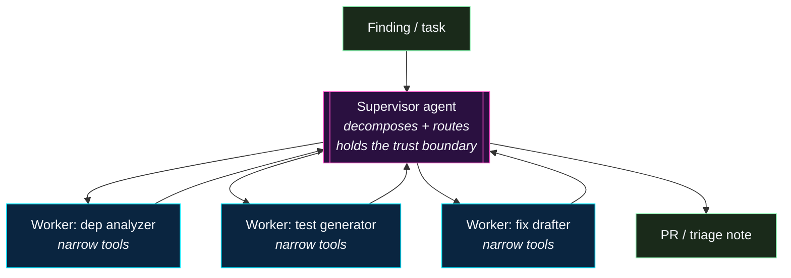
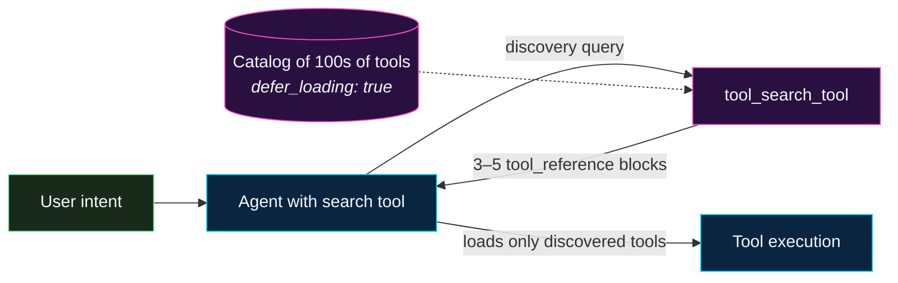
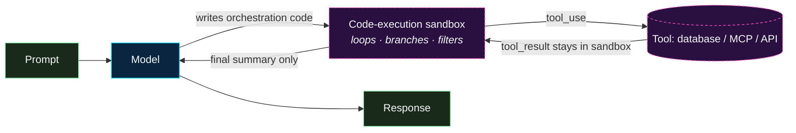
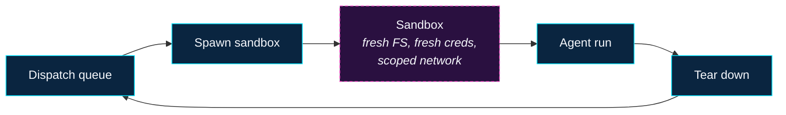
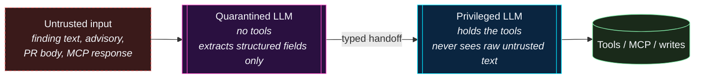
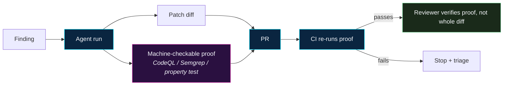


**Moving target.** The patterns on this page are *emerging*, not
settled. Each entry is worth tracking; not every entry will turn
out to be load-bearing. Treat this page as a read-before-you-adopt
scan, not a shopping list.


The reference workflows on this site cover the baseline:
bounded-scope agents behind a reviewer, running deterministic
verification, opening PRs rather than merges. Beyond that
baseline, the broader community is actively experimenting with
patterns and tooling that meaningfully change the cost / benefit
math on agentic remediation.

This page catalogs the ones we think are worth following. For
each: what it is, why it matters, and what to watch for before
betting on it in a production program.

---

## Triage and prioritization

### Reachability-aware CVE prioritization

- **What it is.** Using call-graph / static analysis to decide
  whether a CVE in a dependency is **actually reachable** from
  the service's entry points before opening a remediation task.
  The underlying insight: most CVEs in a typical dependency tree
  are not in code your service ever executes.
- **Why it matters.** Reachability filtering collapses the CVE
  queue by an order of magnitude in most codebases, which makes
  the remaining queue small enough to actually remediate —
  whether by an agent or a human. It also flips the default
  behaviour of an agent from "bump everything" to "bump the
  reachable ones first."
- **Watch for.** False negatives (reachability analysis can miss
  dynamic dispatch, reflection, or framework-mediated calls).
  Unreachable-today can become reachable-tomorrow, so the
  analysis has to re-run on every PR, not just at intake.
- **Representative tooling.** Endor Labs, Semgrep Supply Chain,
  Socket.dev, Snyk Reachability, JFrog Xray. The technique is
  also available in open-source form via `govulncheck` (Go) and
  similar language-specific tools.

### AI-assisted SAST triage

- **What it is.** AI-assisted review of SAST findings that
  decides whether a reported finding is a real issue or a false
  positive, and optionally drafts a fix. The agent sits *after*
  the deterministic scanner, not in place of it.
- **Why it matters.** SAST false-positive rates are the single
  biggest reason SAST programs stall out. AI-assisted triage
  flips the economics — the scanner is still the source of
  truth, but reviewer time goes to the findings the assistant
  couldn't resolve on its own.
- **Watch for.** The assistant accepting bad findings (false
  negatives) is worse than the scanner producing false
  positives. Keep a hold-out set of known-true findings and
  regression against it weekly.
- **Representative tooling.** Semgrep Assistant, Snyk DeepCode
  AI, GitHub Advanced Security's code-scanning autofix,
  SonarQube AI CodeFix.

### Supply-chain reputation scoring

- **What it is.** Per-package reputation signals (maintainer
  churn, typo-squat proximity, capability-manifest drift,
  unusual network / filesystem calls) surfaced alongside
  version metadata at install time. The agent's dispatch layer
  uses the score as an eligibility gate — "can we auto-bump this
  package?" is a function of reputation, not just of CVE
  severity.
- **Watch for.** Scoring is opaque by default. If you integrate
  a reputation feed, require evidence for any score that gates
  behaviour, and keep an override path.
- **Representative tooling.** Socket.dev, Phylum, Snyk, GitHub
  dependency review — plus the OpenSSF Scorecard project for an
  open-source signal bundle.

---

## Orchestration

### Supervisor / worker multi-agent patterns

- **What it is.** Instead of one large agent doing everything,
  a **supervisor** agent decomposes the task into subtasks and
  dispatches them to specialized **worker** agents (e.g., one
  for dependency analysis, one for test generation, one for
  fix drafting). The supervisor holds the trust boundary; the
  workers are narrower and cheaper to sandbox.
- **Why it matters.** Narrower agents are easier to evaluate,
  easier to guardrail, and cheaper to run. The pattern aligns
  neatly with the reviewer-gated, bounded-scope philosophy
  elsewhere on this site.
- **Watch for.** Orchestration complexity compounds fast.
  Start with a two-agent (supervisor + one worker) split before
  adding more.
- **Representative tooling.** LangGraph, CrewAI, AutoGen
  (Microsoft), OpenAI Swarm (experimental), and the
  orchestrator primitives inside each of the five per-tool
  agent platforms on this site.

### Planner / executor separation

- **What it is.** A close relative of supervisor / worker: the
  **planner** produces a stepwise plan as structured text; a
  separate **executor** runs each step with tightly scoped tool
  access. A human (or a verifier agent) can approve the plan
  before execution begins.
- **Why it matters.** Plan review is a natural checkpoint —
  cheaper to catch "the agent is about to do the wrong thing"
  at plan-time than at execution-time.
- **Watch for.** If the executor can't deviate from the plan
  when it's obviously wrong, you're trading safety for
  brittleness. The pattern works when plans are coarse-grained
  and the executor has explicit fall-back-to-ask behaviour.

### Platform-delivered remediation intake

- **What it is.** The code-hosting platform itself exposes a
  "hand this finding to an agent" button on the native finding
  UI — dependency advisories, scanning alerts, dependabot
  entries — and the platform spawns the agent run, opens the
  draft PR, and wires it back to the alert. The assignee
  abstraction is generic: you pick an agent (Copilot, Claude,
  Codex, …), and the platform handles dispatch, auth, and
  result plumbing.
- **Why it matters.** It collapses the whole orchestrator layer
  for teams that don't want to build one. For small orgs, this
  is the shortest path from "we have an SCA queue" to "most of
  the queue is draft PRs waiting for review." For larger orgs
  already running their own orchestrator, it's still useful as
  a *fallback* intake — anything that falls off the main queue
  can still be agent-assigned from the native UI.
- **Watch for.** The platform-spawned agent runs under the
  platform's identity, not your orchestrator's, so your audit
  trail fragments unless you consciously unify it. Also: the
  agent can open multiple draft PRs for the same alert (one per
  assigned agent), which is great for compare-and-pick but
  requires a review convention so the loser PRs get closed
  rather than lingering. And the same reviewer-gate discipline
  still applies — "the platform assigned it" is not a trust
  signal; it's just a dispatch mechanism.
- **Representative shape.** GitHub's Dependabot alert
  assignees (Copilot / Claude / Codex, 2026). Expect
  equivalents from GitLab, Bitbucket, and the SCA vendors as
  the pattern spreads.

### Task budgets as a bounded-run primitive

- **What it is.** A model-side parameter that caps the total
  token spend (thinking + tool calls + tool results + output)
  for a single agent turn or loop. The agent is told up front
  what budget it has, prunes its plan accordingly, and the
  platform hard-stops the run when the ceiling is hit. Shipping
  in first-party APIs (Anthropic's task-budget parameter on
  Opus 4.7; OpenAI's equivalent reasoning budget controls) and
  being standardised into orchestration frameworks as a
  per-run config value.
- **Why it matters.** Cost and safety are the same problem at
  the tail: a runaway loop is both a bill-shock event and a
  blast-radius event. A budget is a deterministic ceiling
  that doesn't depend on the agent noticing it's misbehaving,
  which is exactly the kind of control you want when the
  agent *is* the thing behaving badly. For remediation
  specifically, budgets give you an easy dispatcher-level
  eligibility gate: "if the workflow class's p95 budget is 40k
  tokens, any run exceeding 2× is an anomaly to investigate."
- **Watch for.** Budgets don't replace stop-and-ask semantics —
  a run that hits its budget should *stop and triage*, not
  silently emit a partial answer. Wire the budget-exhausted
  exit path into the same triage-note surface the agent uses
  when it hits other guardrails, and alert on a rising rate of
  budget-exhaustion (the first signal of a prompt-regression
  or a new model under-performing).
- **Representative shapes.** Anthropic's task-budget parameter
  (Opus 4.7), OpenAI reasoning-budget controls, LangGraph /
  CrewAI per-node budget enforcement, orchestrator-level
  wallclock + token caps.

### Chain-of-verification

- **What it is.** The agent generates an answer, then generates
  a set of verification questions about its own answer, then
  answers those questions with fresh context, and revises. The
  technique is originally from question-answering research
  (Dhuliawala et al.) but has become a common building block in
  agent prompts.
- **Why it matters.** It's a cheap way to catch confabulated
  facts (made-up file paths, non-existent function names) before
  the agent commits them to a PR.
- **Watch for.** It doubles token cost. Worth it on high-stakes
  steps (the final PR body, the proposed patch); overkill on
  every intermediate reasoning step.

---

## Agent platform primitives

A short run of protocol-level primitives that changed what
counts as a sensible agent design in 2025–2026. These map
one-to-one onto features shipped in the Claude API and the MCP
spec, and they're summarised here because each of them re-opens
design decisions elsewhere on this site. See
[MCP Server Access → Where MCP is heading in 2026]()
for the roadmap context.

### Progressive tool discovery and tool search

- **What it is.** Instead of loading every tool definition into
  the system-prompt prefix, tools are marked `defer_loading:
  true` and surfaced on demand via a **tool search tool** (regex
  or BM25). The agent searches the catalog, the API returns 3–5
  `tool_reference` blocks, and those are expanded inline into
  full tool definitions for this turn. The catalog stays outside
  the context; only what's needed gets loaded.
- **Why it matters.** Tool definitions eat a surprising
  percentage of context. A typical multi-server setup (GitHub +
  Slack + Sentry + Grafana + Splunk) can consume ~55k tokens in
  definitions before any real work happens. Tool selection
  accuracy also drops noticeably past 30–50 visible tools.
  Progressive discovery reports ~85%+ reductions in
  tool-definition token cost, and Claude Code applies it
  automatically, deferring servers whose definitions would
  otherwise exceed ~10% of the context window. The practical
  effect for remediation programs: you can expose a
  catalog-scale connector fleet (hundreds to low thousands of
  tools) to a single agent without paying the context-bloat or
  accuracy tax.
- **Watch for.** More reachable tools means more tool-poisoning
  surface area (descriptions are prompt-layer input). Pin
  descriptions, diff them on update, and keep the gateway's
  allowlist as the real scoping boundary — see
  [Threat Model → tool poisoning]().
  Also: keep 3–5 highest-frequency tools non-deferred;
  discovery latency is real.
- **Representative tooling.** Anthropic's
  [tool search tool](https://platform.claude.com/docs/en/agents-and-tools/tool-use/tool-search-tool)
  (regex and BM25 variants), Claude Code's progressive tool
  discovery, MCP gateway catalogs that implement the same shape
  server-side, and embeddings-based custom implementations via
  the `tool_reference` block format.

### Programmatic tool calling

- **What it is.** Instead of round-tripping the model once per
  tool call, the model writes a Python script inside a
  code-execution sandbox that invokes tools as async functions
  — with loops, conditionals, early-termination, filtering,
  aggregation, error handling. Tools are opted in with
  `allowed_callers: ["code_execution_20260120"]`. Intermediate
  `tool_result` payloads stay in the sandbox; only the final
  output returns to the model's context.
- **Why it matters.** For any remediation workflow with 3+
  dependent tool calls, this pattern can reduce token use by
  an order of magnitude and cut latency proportionally. Concrete
  shapes this unlocks: batched reachability triage across a
  large finding queue; multi-source correlation (advisory feed
  + SBOM + CODEOWNERS) in one sandbox run; large-diff reasoning
  where file contents never enter context.
- **Watch for.** Tools served by the Anthropic
  [MCP connector](https://platform.claude.com/docs/en/agents-and-tools/mcp-connector)
  are currently **not** callable programmatically — the feature
  works against first-party API tools plus self-hosted tools
  in the sandbox. If you want the pattern over MCP today, you
  implement the sandbox + tool-routing yourself. Expect this to
  change; track the feature-gate. Security implication: tool
  results become strings the sandbox may interpret as code —
  validate external tool output the same way you'd validate
  any untrusted string reaching an eval boundary.
- **Representative tooling.** Anthropic's
  [programmatic tool calling](https://platform.claude.com/docs/en/agents-and-tools/tool-use/programmatic-tool-calling)
  (GA on Claude API; Sonnet 4.5+, Opus 4.5+), self-hosted
  sandboxed equivalents, and client-side direct-execution for
  trusted-environment cases. On agentic benchmarks like
  BrowseComp and DeepSearchQA, programmatic tool calling has
  been the single most reported unlock for multi-step agent
  performance.

### Elicitation: structured input from the user

- **What it is.** An MCP primitive (shipped September 2025) that
  lets a server pause mid-execution and ask the user for
  *structured* input — a JSON-schema form rather than a free-
  text prompt. The agent is a participant in the handoff, not
  the target of the question.
- **Why it matters.** Remediation workflows frequently need
  a mid-run human decision: "vulnerable dep or vulnerable
  config?", "apply the breaking bump or stop?", "approve the
  registry push?". Elicitation gives those decisions a native
  home: typed, auditable, outside the free-text channel where
  injection is easiest. It also gives connectors a native way
  to elicit one-time credentials without storing them in a
  prompt.
- **Watch for.** Elicitation requests are *also* prompt-layer
  surface — a compromised server could craft an elicitation that
  reads like a social-engineering payload. Schema-constrain the
  fields and surface the elicitation in the orchestrator's UI,
  not in the raw model stream.
- **Representative tooling.** MCP clients that implement the
  elicitation spec (client-side); MCP SDKs that expose it
  server-side; the `elicitation/create` request/response shape
  in the 2025-09 MCP spec.

### MCP tasks primitive for long-running work

- **What it is.** An experimental MCP primitive (Dec 2025) for
  work that outlives a single request/response cycle. The agent
  submits a task; the server returns a task handle; the agent
  (or an orchestrator queue) polls or receives callbacks as
  state evolves. Designed for CI runs, long test suites, staged
  rollouts, and anything measured in minutes-to-hours.
- **Why it matters.** The dominant 2024–2025 workaround was
  "agent holds connection open and retries" or "orchestrator
  queues its own tasks and polls each server in a bespoke way."
  The tasks primitive formalises the pattern into the protocol,
  so both sides of the connection agree on the lifecycle.
- **Watch for.** A single user intent can fan out into a tree
  of tasks across several servers. Plan for a correlation ID
  that spans the tree — otherwise your audit trail fragments
  and postmortems get painful.
- **Representative tooling.** The 2025-12 MCP spec's
  experimental tasks primitive; MCP SDKs as they adopt it;
  orchestrator queues (LangGraph, Temporal, Inngest, internal
  queues) that expose MCP-task-shaped work items.

### MCP applications

- **What it is.** A packaging shape on the 2026 MCP roadmap:
  server + tools + UI + skills delivered as one "application"
  the agent can embed or hand off to. Concretely, this looks
  like "the SCA vendor ships an MCP application that owns the
  scanning + reproduction UX, and your agent composes it
  rather than re-implementing it."
- **Why it matters.** Moves the vendor boundary up a level. A
  reference remediation pipeline becomes "agent orchestrates a
  small set of MCP applications," not "agent + ten
  point-integrations each with their own quirks."
- **Watch for.** Gateway design has to accommodate
  multiple co-resident applications, not just a tool-name fan-
  out. Identity and audit needs to pass through the
  application boundary; you don't want an application to become
  a new un-audited layer.
- **Representative shape.** The MCP applications primitive
  landing in early 2026. Expect SCA, SAST, DAST, ticketing,
  and code-hosting vendors to ship applications rather than
  one-off tool surfaces.

---

## Identity and access for agents

### Agent identity as a first-class principal

- **What it is.** Treating every agent run as its own
  identifiable actor — not a shared "bot" account, not the
  human who dispatched it, not a workload identity bound to
  the sandbox container. The run presents credentials tied to
  **(agent class, workflow, invoking principal, task ID)**,
  and those credentials expire at the end of the run. Audit
  logs downstream (MCP gateway, git host, ticket system)
  record the *agent's* identity on every action, with a link
  back to the human or queue that authorized the work.
- **Why it matters.** A workload identity can prove which
  container ran; it cannot prove what the reasoning inside
  that container was permitted to do. For security-scoped
  remediation — where an agent may hold read access to
  findings, write access to a repo, and call credentials
  scoped to bumps — the difference between "who ran the
  process" and "what the process was authorized to do" is
  the difference between a recoverable incident and a
  confused-deputy blast radius. Regulated programs are
  beginning to require this distinction explicitly (EU AI Act
  audit-trail obligations, emerging US state AI accountability
  acts), and several compliance frameworks now treat a shared
  agent credential the same way they'd treat a shared root
  SSH key.
- **Watch for.** Four common failure modes worth naming in a
  design review:
    - *Human-credential borrowing.* An agent that runs under
      the dispatching user's token inherits that user's full
      blast radius. Short-lived, scoped agent identities cost
      more to set up once but remove the entire class.
    - *Shared "bot" accounts.* If every agent run authenticates
      as `ci-bot` or `copilot-bot`, every tool call is
      indistinguishable in the log — and so is every
      compromise.
    - *No human-owner link.* Every agent identity should name
      a mandatory human owner, the way every SSH key names a
      person. "Who do you page when this identity misbehaves?"
      must have an answer before the identity is issued.
    - *No revocation path.* A kill switch for the *fleet* is
      not a kill switch for *this run* — revocation needs to
      be per-identity and near-instant.
- **Representative shapes.** Per-run workload-identity issuance
  (SPIFFE/SPIRE patterns adapted for agents), OIDC-bound
  short-lived tokens minted by the MCP gateway per call,
  vendor-specific agent-identity products (Aembit, Strata,
  Entrust and others), and the emerging class of "agent IAM"
  controls Gartner is tracking alongside traditional IAM. The
  2026 design posture: agent identities are their own
  principal class — not humans, not workloads — with mandatory
  ownership, just-in-time scoping, and instant revocation.

---

## Sandbox and execution runtimes

### Ephemeral, per-run sandboxes

- **What it is.** Instead of running agents inside a
  long-lived container, each run gets a fresh, ephemeral
  execution environment — a VM, micro-VM, or container created
  at dispatch and torn down at completion. Filesystem, network,
  credentials, and process state are all fresh.
- **Why it matters.** Blast radius of a compromised or runaway
  agent is bounded by the lifespan of the sandbox. Persistent
  exploitation becomes much harder.
- **Watch for.** Cold-start latency. For high-throughput
  queues, you need a warm pool or a very fast boot path.
- **Representative tooling.** e2b, Daytona, Modal, Morph Labs,
  Firecracker micro-VMs (AWS Lambda's substrate), gVisor.

### Browser sandboxes for agents with web access

- **What it is.** Agents that need web access run inside a
  heavily instrumented browser (Playwright, Puppeteer, or a
  custom agent browser) with DOM-level policy — not inside the
  host browser.
- **Why it matters.** A browser is the highest-risk tool an
  agent can hold: every page is a potential prompt-injection
  payload. Isolating it behind a sandboxed browser with a
  per-run profile makes it safer.
- **Representative tooling.** Browserbase, Playwright-based
  agent harnesses, Anthropic's Claude-in-Chrome and similar
  vendor offerings.

### Policy-as-code for agent tool calls

- **What it is.** Policy engines (OPA / Cedar / custom) sit
  between the agent and its tools. Every tool call is
  policy-checked before it fires: "is this agent allowed to
  write to `db/migrations/*.sql`?", "is the target URL on the
  allowlist?", "has the daily token budget been exceeded?".
- **Why it matters.** Moves guardrails from prose in the prompt
  (where the agent can talk itself out of them) to enforced
  policy (where it can't). Policy is also auditable and
  reviewable separately from prompt changes.
- **Representative tooling.** Open Policy Agent (OPA), Cedar,
  Kyverno (for Kubernetes-scoped agents), custom ingress
  policies on MCP gateways. See also the
  [MCP Gateways]() writeup.

---

## Guardrail and safety frameworks

### Dual-LLM control-flow isolation

- **What it is.** A control-flow architecture that splits the
  agent in two. A **privileged LLM** plans and calls tools but
  never reads attacker-influenced text. A **quarantined LLM**
  reads the untrusted content (advisory bodies, PR comments,
  MCP responses, web pages) and emits a *typed, schema-
  validated* handoff — never free text — back to the
  privileged side. The original Google DeepMind framing
  (CaMeL, 2025) is now the reference shape for prompt-injection-
  resistant agents; 2026 enterprise extensions add capability
  metadata, output auditing, and a small intermediate
  language for the handoff.
- **Why it matters.** It's a *positive* architectural answer
  to the lethal trifecta — instead of "remove one of {private
  data, untrusted content, outbound channel}," it removes the
  *path* between them. For remediation specifically, the shape
  is natural: one agent reads the vulnerability report and
  produces a typed `{cve, package, fixed_version, file_paths}`
  record; a second agent writes the patch from that record and
  never sees the report's prose. The reviewer gate stays in
  place; the attacker's surface area collapses.
- **Watch for.** The handoff schema is the new attack surface.
  An overly-permissive field (a free-text `notes` slot, an
  unbounded `paths` array) re-creates the channel you just
  removed. Treat the schema like a security policy: minimum
  fields, bounded sizes, enumerated where possible. Also: the
  privileged side still trusts tool *responses* — pair with
  the size caps and trust tiers in
  [Threat Model → poisoned MCP responses]().
- **Representative shapes.** Google DeepMind's CaMeL pattern;
  Simon Willison's "two LLMs" framing; supervisor / worker
  splits where the supervisor reads only typed worker output;
  programmatic-tool-calling sandboxes used as the privileged
  executor with a separate "summariser" LLM acting as the
  quarantined reader.

### NeMo Guardrails (NVIDIA)

- **What it is.** A Python framework for adding input
  validation, output validation, topic constraints, and
  dialogue-flow constraints around an LLM. Guardrails are
  specified in Colang, a small domain-specific language.
- **Why it matters.** Gives you a place to put constraints that
  doesn't depend on prompt discipline alone. Works well in
  front of a model API call or wrapped around a tool invocation.
- **Where.** `github.com/NVIDIA/NeMo-Guardrails`.

### Guardrails AI

- **What it is.** A Python library that validates LLM
  outputs against schemas and policies, and can repair or
  reject outputs that violate them. Ships with a hub of
  reusable validators.
- **Why it matters.** Schema validation on agent output (PR
  body shape, structured triage note shape, policy
  conformance) is one of the cheapest-to-operate controls a
  program can add. Guardrails AI makes it a library call.
- **Where.** `github.com/guardrails-ai/guardrails`.

### LLM Guard (Protect AI)

- **What it is.** An open-source toolkit of input and output
  scanners (prompt-injection detection, PII redaction, bias,
  toxicity, secrets) packaged as a pluggable pipeline.
- **Where.** `github.com/protectai/llm-guard`.

### Provider-native safety layers

- Most major providers publish moderation / safety endpoints
  (OpenAI Moderation, Anthropic Claude's constitutional
  responses, Google's Responsible AI filters). Treat these as
  defence-in-depth, not primary controls.

---

## Verification and provenance

### Proof-carrying patches

- **What it is.** The agent's output is not just a diff — it's a
  diff **plus a machine-checkable artifact** (a CodeQL query
  result, a Semgrep rule match, a passing property test) that
  proves the diff resolves the original finding. The reviewer
  checks the proof, not the whole diff.
- **Why it matters.** Reviewer time is the rate-limiting step
  in almost every remediation program. Anything that turns
  review into "verify the proof" instead of "re-understand the
  entire diff" compounds.
- **Watch for.** The proof has to be cheap to re-run and hard to
  forge. Store the proof next to the diff in the PR; re-run it
  in CI.
- **Representative shapes.** CodeQL queries attached as
  SARIF to the PR; Semgrep rules run with `--baseline-ref`;
  property tests asserting the old failure mode is gone.

### SLSA provenance for agent-produced PRs

- **What it is.** Cryptographic provenance on the build
  artifacts produced from an agent-authored PR — what source
  produced this binary, on what runner, invoked by whom. SLSA
  (Supply-chain Levels for Software Artifacts) formalises the
  requirements.
- **Why it matters.** Provides an audit trail for "who
  authored this code, and what actually ran in CI". Useful when
  compliance asks "how do we know a human approved this
  change?" — the SLSA statement can record the reviewer.
- **Where.** `slsa.dev`. Tooling: `cosign`, `witness`, and
  in-toto attestations.

### Sigstore / cosign for signed commits and attestations

- **What it is.** Keyless signing (OIDC-bound) for git commits
  and build attestations. The agent's commits are signed with a
  workload identity that can be distinguished from human
  commits at audit time.
- **Why it matters.** Fingerprinting agent-authored commits is
  a small, concrete step toward compliance-grade traceability.
- **Where.** `sigstore.dev`.

### Reproducible builds for agent outputs

- **What it is.** If an agent's output is a built artifact
  (a generated config, compiled binary, synthetic test corpus),
  making the build reproducible means the reviewer can
  verify by rebuild. Combine with SLSA provenance for a full
  "who built this, and can I re-derive it" story.

---

## Observability for agents

### Agent-specific tracing and eval platforms

- **What it is.** Purpose-built observability for LLM and
  agent workloads: per-run traces of every model call, tool
  call, prompt, and response, with eval scores attached.
- **Why it matters.** Reviewing agent behaviour without
  traces is guesswork. Traces are what turn "the agent
  produced a weird PR" from a vibe into a debuggable event.
- **Representative tooling.** LangFuse (open source), Helicone
  (open source), LangSmith (LangChain), Arize Phoenix, W&B
  Weave, Braintrust, Datadog LLM Observability.

### Prompt regression testing

- **What it is.** A versioned suite of inputs + expected-shape
  outputs (or eval-scored outputs) that runs on every prompt
  change and every model bump. Think "unit tests for prompts."
- **Why it matters.** Without regression tests, you will find
  out about prompt regressions when reviewers start bouncing
  PRs. With them, you find out in CI.
- **Representative tooling.** Promptfoo, DeepEval, LangSmith
  evals, Braintrust, OpenAI Evals. See also
  [Reputable Prompt Sources]().

### Drift detection

- **What it is.** Metrics + alerts for behavioural drift: merge
  rate, review turnaround, false-positive rate, tool-call
  distribution, per-prompt cost. A change in the underlying
  distribution is usually the first sign of a model change, a
  prompt regression, or a changed input distribution.
- **Why it matters.** Models get updated silently by vendors.
  Prompts shift under you. Drift detection is how you notice.
- **Cross-link.** See
  [Program Metrics & KPIs]()
  for what to measure.

---

## Container and image security

### Golden images and base-image hygiene

- **What it is.** A centrally owned set of pre-hardened base
  container images that every team starts from. Scanned,
  signed, SBOM-embedded, and rebuilt on a known cadence — see
  [Automation → Golden images]()
  for the full treatment.
- **Why it matters here.** Golden images turn container-image
  scanning from "every team triages the same base-layer CVEs
  independently" into "platform rebuilds once, every team picks
  up the fix on the next deploy." That shape pairs directly
  with the
  [Vulnerable Dependency Remediation]()
  workflow — with golden images, the agent's PR is almost
  always a single-line `FROM` bump.

### Capability-scoped container runtimes

- **What it is.** Runtimes that enforce seccomp, AppArmor /
  SELinux, and capability drops by default — often as a
  required admission policy. Agents running inside such a
  sandbox can't easily escape even if their prompt is
  compromised.
- **Representative tooling.** gVisor, Kata Containers,
  Firecracker, and admission controllers like OPA Gatekeeper
  or Kyverno enforcing the `restricted` Kubernetes PSS profile.

---

## Coding standards evolving under agents

### Cross-host agent skills

- **What it is.** The "skill" concept that originated with
  Claude Code — a named, packaged workflow (folder + instruction
  file + helper scripts) an agent can invoke — has evolved into a
  portable unit that multiple agent hosts (Claude Code, Copilot,
  Cursor, Codex CLI, and others) can load and run. Package
  managers and CLIs (for example, `gh skill` in the GitHub CLI)
  are emerging to distribute skills the way Homebrew distributes
  binaries.
- **Why it matters.** Until recently, writing a
  "CVE-triage" or "SDE-remediation" workflow meant porting the
  same logic into four different file formats
  (`.claude/skills/…`, `.cursor/rules/…`, a Codex driver script,
  a Copilot instructions block). A portable skill format
  collapses that duplication and lets a team ship one artifact
  against whichever host each developer happens to use.
- **Watch for.** Host-specific capability drift. The same skill
  may have different tool authority on different hosts; treat
  each host + skill combination as its own eval target until the
  capability surfaces converge.
- **Representative tooling.** The skill formats inside each
  of the five agent hosts this site documents (Claude, Copilot,
  Cursor, Codex, Devin), the emerging `gh skill` command in the
  GitHub CLI, and the skill metadata conventions forming around
  the MCP ecosystem.